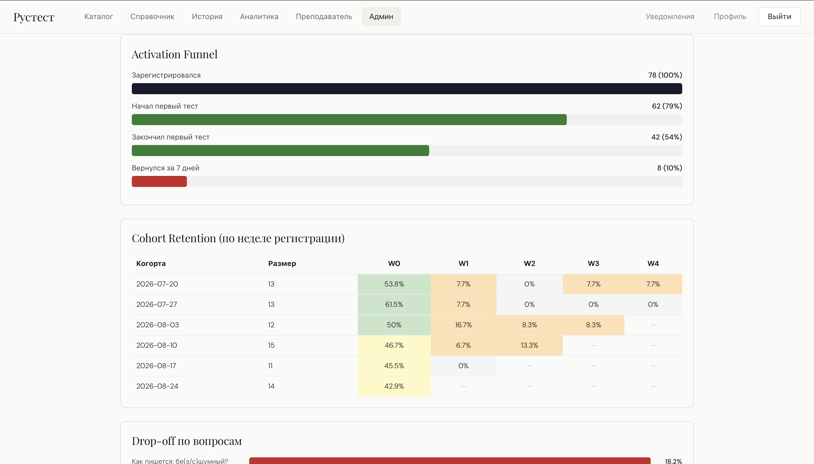
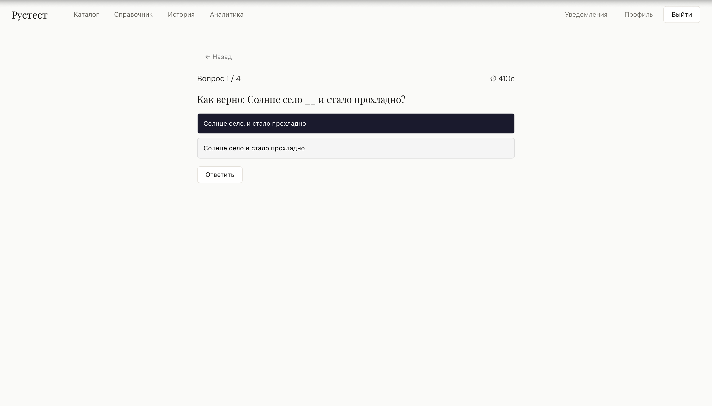
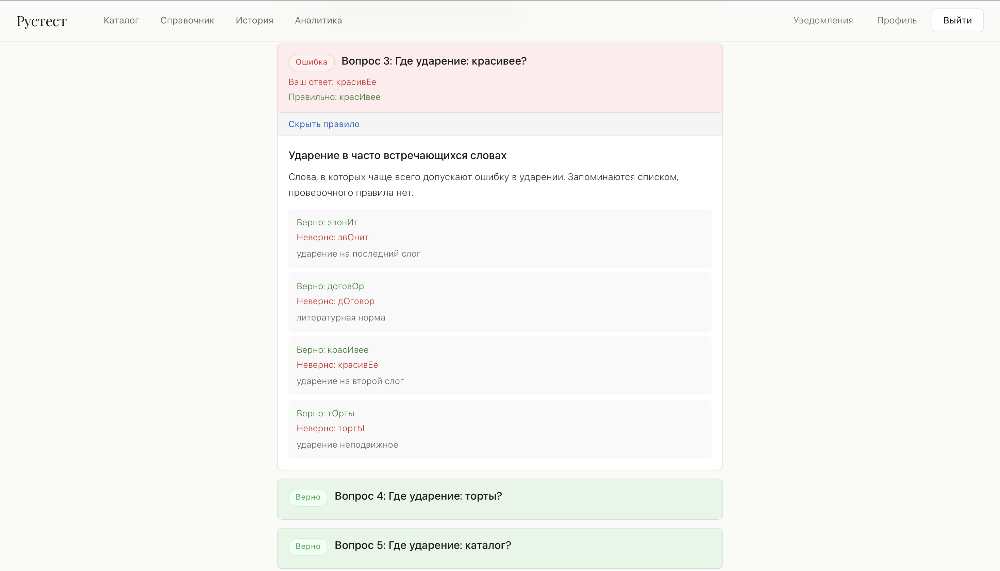

# РусТест

**Образовательная платформа для тестирования знаний русского языка — и полигон продуктовой аналитики поверх неё: когортный retention, активационная воронка, детекция оттока, A/B-тесты.**


---



---

## Главное: аналитика как отдельный слой

Метрики считаются не на Kaggle-датасете, а на событийном логе живого продукта — от регистрации до ответа на конкретный вопрос.

| Модуль | Что реализовано |
|---|---|
| **Cohort Retention** | Настоящая heatmap по неделям регистрации, W0–W4. Ненаступившая неделя отдаётся как `null` и рисуется прочерком — это не 0 % оттока, а «считать рано» |
| **Activation Funnel** | Регистрация → первый старт → завершение → возврат за 7 дней. Собирается из **двух микросервисов**: событие регистрации живёт в auth-service, поведение — в result-service |
| **Churn Risk** | Ученики с ≥2 попытками и без активности N дней, с фильтром по группе преподавателя |
| **Сегментация** | Воронка и drop-off в разрезе роли и наличия преподавателя; сегменты <30 наблюдений помечаются как статистически ненадёжные |
| **A/B-тесты** | Интеграция с внешним [ExperimentHub](#связанные-проекты): назначение варианта при старте попытки, метрика `completion` при завершении |

**20 аналитических эндпоинтов**, вся логика — в одном файле [`result-service/app/analytics.py`](services/result-service/app/analytics.py).

### Цифры на демо-наборе

> 78 учеников, 6 недельных когорт, 82 попытки. Данные синтетические, но реалистично распределённые — генератор [`scripts/seed_demo_data.py`](scripts/seed_demo_data.py) моделирует 5 поведенческих групп: возвращающихся, угасающих, одноразовых, не начавших и бросивших тест.

| Метрика | Значение |
|---|---|
| Конверсия прохождения | **65,9 %** (82 старта → 54 завершения) |
| Retention D1 / D7 | **19,0 % / 14,3 %** |
| Активация: дошли до результата | **54 %** от зарегистрировавшихся |
| Вернулись за 7 дней | **10 %** |
| Ученики в зоне оттока | **3** (14, 25 и 29 дней без активности) |

**Точка наибольшей потери** — между регистрацией и первым завершённым тестом: 78 → 62 → 42.

---

## Продукт

**Ученик** — каталог с фильтром по темам, тест с таймером, разбор каждой ошибки с раскрывающимся правилом, личная аналитика прогресса.
**Преподаватель** — ученики, приглашения, ссылки на тест, групповой отчёт, список риска оттока.
**Администратор** — конструктор тестов, управление ролями, справочник правил, дашборд аналитики, выгрузка в Excel.

Роли `guest → user → teacher → admin` зашиты в JWT; сервисы проверяют подпись локально общим секретом, без похода в auth-service.

<p align="center">
  
  
</p>

---

## Стек

| Слой | Технологии |
|---|---|
| Backend | Python 3.11, FastAPI, SQLAlchemy 2.0, Alembic, python-jose (JWT), passlib/bcrypt |
| Аналитика | pandas, openpyxl (Excel-экспорт) |
| Frontend | React 18, Vite, React Router 6, axios |
| Данные | PostgreSQL 16 |
| Инфраструктура | Docker Compose, nginx (reverse proxy + статика) |

---

## Архитектура

```
                    ┌─────────────────┐
   браузер ────────▶│  nginx :3001    │  SPA + маршрутизация по префиксу
                    └────────┬────────┘
          ┌──────────────┬───┴────────┬──────────────┐
          ▼              ▼            ▼              ▼
    auth-service   test-service  result-service  reference-service
       :8011          :8002         :8003            :8004
     users          tests         attempts          rules
     teacher_       questions     answers           rule_examples
     students       options       event_logs
     notifications  test_links         │
          │                            │
          └──── событие registered ───▶│  (fire-and-forget)
          └──────────────┬─────────────┴──────────────┘
                         ▼
                  PostgreSQL :5433
```

Каждый сервис владеет своим набором таблиц в общей базе. **Внешние ключи не пересекают границы сервисов** — межсервисные ссылки хранятся обычными integer-колонками.

Дата регистрации нужна для когорт, но живёт в auth-service. Вместо синхронного запроса из аналитики выбрана передача события: auth-service шлёт `registered` в result-service при создании пользователя, в `try/except` — недоступность аналитики не ломает регистрацию. Плата за это — событие теряется без retry, компромисс осознанный.

---

## Быстрый старт

```bash
git clone https://github.com/kuznetsovskdh/rustest.git && cd rustest
docker network create eh_network        # compose подключается к внешней сети
cp .env.example .env                    # заполнить креды и JWT_SECRET
docker compose up --build
```

Открыть **http://localhost:3001**. Документация сервисов — `localhost:<порт>/docs`.

Регистрация выдаёт роль `user`; отдельного эндпоинта для создания администратора нет — роль присваивается в БД:

```sql
UPDATE users SET role='admin' WHERE email='ваш@email';
```

Наполнить каталог и демо-данными:

```bash
python3 scripts/seed_content.py   --email <admin> --password <pass>   # 9 тестов, 10 правил
python3 scripts/seed_demo_data.py --email <admin> --password <pass> --reset
```

---

## Инженерные детали

**Когортная методология.** Первая версия группировала пользователей по календарной неделе регистрации, а смещение W1–W4 считала скользящими 7 днями от личного времени регистрации. Из-за этого воскресный регистрант, зашедший в понедельник, попадал в W0, хотя календарно это уже следующая неделя. Обе оси приведены к календарным неделям.

**Гонка при регистрации.** Параллельные запросы с одинаковым email пробивали проверку «email занят» и падали с необработанным `IntegrityError` — HTTP 500 вместо 400. Проверено восемью одновременными запросами: сейчас один 200 и семь корректных 400.

**Устойчивость к рестарту БД.** `docker compose up` перезапускает Postgres, и все четыре сервиса начинали отдавать 500 на протухших соединениях из пула, пока те не переработаются. Лечится `pool_pre_ping=True` на каждом движке.

**Отказ одного сервиса не роняет остальные.** Проверено остановкой reference-service: каталог, прохождение теста и аналитика продолжают работать, недоступен только справочник.

---

## Ограничения

- Правильность ответа приходит с клиента: `GET /tests/{id}` отдаёт `is_correct` всех вариантов. Для тренажёра приемлемо, для оценивания — нет.
- Упрощённый `get_retention` (D1/D7 от первой попытки) оставлен рядом с когортным — сознательно, для сравнения двух методологий на одних данных.
- Аналитика читает таблицы auth-service сырым SQL: переименование колонки в `users` тихо сломает сегментацию.
- Смена роли и заморозка аккаунта действуют только со следующего токена.
- Автотестов нет; проверка — сквозным прогоном через nginx тем же путём, что и браузер.
- Агрегация идёт в pandas, а не в SQL: `analytics.py` выгружает строки `event_logs` и `attempts` в DataFrame целиком. На демо-объёмах это быстрее в разработке, на проде метрики нужно переносить в SQL с оконными функциями.

---
